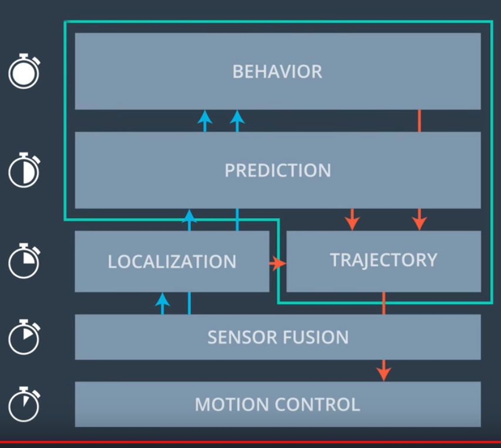
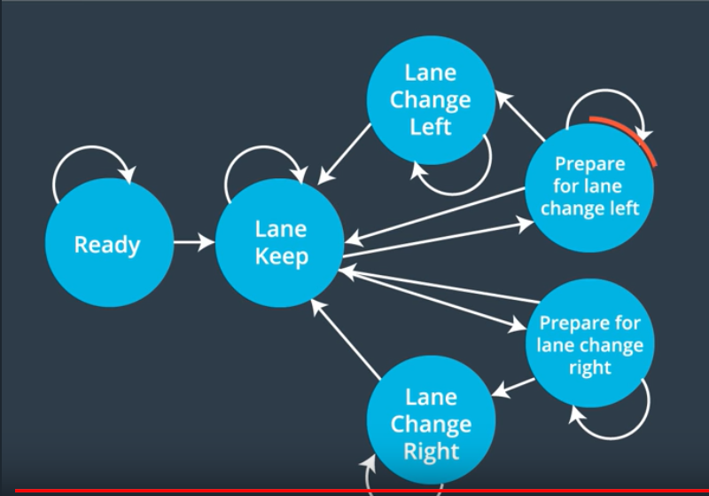

## Path-Planning 2D
-----------------------------
   
### Goals 
The goal of this project is to build a path planner to have a vehicle, which can navigate around a virtual highway with other vehicles, all going different speeds (with the maximum speed : 50 MPH).

The Path Planner must create a smooth, safe path for the car to follow along a 3 lane highway. 

The implementation will be done in C++.

-----------------------------
### Input Data 
The simulator provides :
- the car's localization,
- the sensor fusion data with the other car's position and velocity. 

The map of the highway is in ./data/highway_map.txt. 

Each waypoint has an (x,y) global map position, and a Frenet 's' value and Frenet 'd' unit normal vector (split up into the x component, and the y component). 

The 's' value is the distance along the direction of the road.

The 'd' vector can be used to calculate lane positions. 

The highway has 6 lanes total - 3 heading in each direction. Each lane is 4 m wide.

------------------------------
### Requirements
Our restrictions are the following :
- the car must go as close as possible to the 50 MPH speed limit, which means passing slower traffic when possible,
- the car should avoid hitting other cars,
- the car should not experience total acceleration over 10 m/s^2 and jerk that is greater than 10 m/s^3.

------------------------------
### Basic Definition
##### Main car's localization Data
The car transmits its location. 
- ["x"] The car's x position in map coordinates
- ["y"] The car's y position in map coordinates
- ["s"] The car's s position in frenet coordinates
- ["d"] The car's d position in frenet coordinates
- ["yaw"] The car's yaw angle in the map
- ["speed"] The car's speed in MPH

###### Previous path data given to the Planner
- ["previous_path_x"] The previous list of x points previously given to the simulator
- ["previous_path_y"] The previous list of y points previously given to the simulator

###### Previous path's end s and d values 
- ["end_path_s"] The previous list's last point's frenet s value
- ["end_path_d"] The previous list's last point's frenet d value

###### Data sent to the Simulator
The C++ program must compute and send to the simulator a list of x and y global map coordinates. 
Each pair of x and y coordinates is a point, and all of the points together form a trajectory. 
The car moves to a new waypoint every 20ms.

---------------------------------
### PIPELINE 
This picture resume the SW pipeline :
<p align="center">

</p> 


#### Step 1 : Sensor Data Fusion
The "sensor fusion" variable contains all the estimation information about the cars on the right-hand side of the road.
The data format for each car is [id,x,y,vx,vy,s,d] :
- ["ID"] : car's unique identifier, 
- ["x"] : car's position in global map coordinates, 
- ["y"] : car's position in global map coordinates, 
- ["vx"] : car's velocity in m/s in global map coordinates, 
- ["vy"] : car's velocity in m/s in global map coordinates, 
- ["s"] : car's position in local Frenet coordinates,
- ["d"] : car's position in local Frenet coordinates. 

- The vx,vy values are useful for the prediction where the cars will be in the future.
- The future predicted Frenet 's' value will be its current 's' value plus its transformed total velocity(m/s) multiplied by the time elapsed into the future(s). 


#### Step 2 : Behavior Control
The "behavior control" is composed about 3 steps : 
- Step 1 : ACC = Adaptive Cruise Control : control the safety distance between the current vehicle and the vehicle front, 
- Step 2 : Finite State Machine : Keep Lane State/ Prepare change Lane Right / Prepare Change Lane left, depends of the position of the vehicle on the different lanes, 
- Step 3 : Lane Changer accepted or not (depends of the result of the step 2).

<p align="center">

</p> 


#### Step 3 : Spline Creation
The target is to create paths to smoothly change lanes.

It's the creation of 5 points that the spline will use to generate the function that will connect such point in a smooth trajectory.

The spline fitting guarantees that the generated function passes through every point.

The acceleration and jerk part are solved from linear equations for 's' and 'd' functions with the provided Eigen 3-3 library.

The last part is the function to transform the (s,d) points to (x,y) points for the returned path.


#### Step 4 : Waypoint Planner
The target is to create each of the individuals points in x that the car fill follow feed them into the "spline function" (from the Step 3 : Spline creation) to look for the corresponding y.

The first waypoint from the previous path are used and the rest of the new path based on the new data from the car's sensor fusion.     

-----------------
### External ressources for the step 3 : "Spline Creation"
For the creation of a smooth trajectories (Step : Spline Creation) : http://kluge.in-chemnitz.de/opensource/spline/

------------------------------
### Basic Build Instructions
This project involves the Term3 Simulator which can be downloaded [here](https://github.com/udacity/self-driving-car-sim/releases/tag/T3_v1.2).

Once you clone this repo, it includes two files that can be used to set up and install [uWebSocketIO](https://github.com/uWebSockets/uWebSockets) for either Linux or Mac systems. For windows you can use either Docker, VMware, or even [Windows 10 Bash on Ubuntu](https://www.howtogeek.com/249966/how-to-install-and-use-the-linux-bash-shell-on-windows-10/) to install uWebSocketIO. 

Once the install for uWebSocketIO is complete, the main program can be built and run by:
1. Clone this repo.
2. Make a build directory: `mkdir build && cd build`
3. Compile: `cmake .. && make`
4. Run it: `./path_planning`.

Refer to the [Udacity project repository](https://github.com/udacity/CarND-Path-Planning-Project) for more detail installation instructions.

-------------------------------
### Dependencies

* cmake >= 3.5
  * All OSes: [click here for installation instructions](https://cmake.org/install/)
* make >= 4.1
  * Linux: make is installed by default on most Linux distros
  * Mac: [install Xcode command line tools to get make](https://developer.apple.com/xcode/features/)
  * Windows: [Click here for installation instructions](http://gnuwin32.sourceforge.net/packages/make.htm)
* gcc/g++ >= 5.4
  * Linux: gcc / g++ is installed by default on most Linux distros
  * Mac: same deal as make - [install Xcode command line tools]((https://developer.apple.com/xcode/features/)
  * Windows: recommend using [MinGW](http://www.mingw.org/)
* [uWebSockets](https://github.com/uWebSockets/uWebSockets)
  * Run either `install-mac.sh` or `install-ubuntu.sh`.
  * If you install from source, checkout to commit `e94b6e1`, i.e.
    ```
    git clone https://github.com/uWebSockets/uWebSockets 
    cd uWebSockets
    git checkout e94b6e1
    ```


